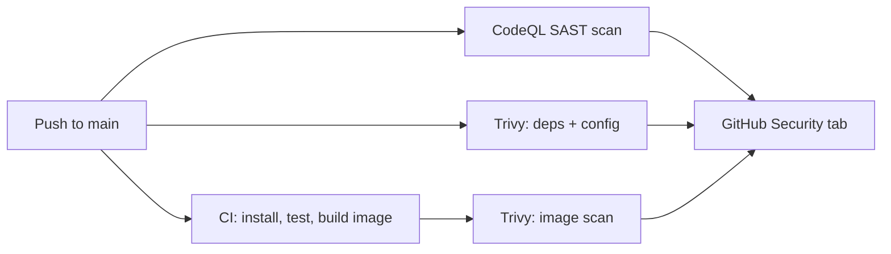

# Secure Pipeline Demo

A small Flask app whose **entire CI/CD pipeline has security built in**.
Every push to `main` (and every pull request) is automatically scanned —
results land in GitHub's **Security** tab.

## What's scanned

| Scanner | What it covers |
| ------- | -------------- |
| CodeQL  | Static analysis (SAST) of the Python code |
| Trivy   | Vulnerable dependencies (filesystem scan) |
| Trivy   | Dockerfile / config misconfigurations |
| Trivy   | Vulnerabilities in the built Docker image |

Scans also run on a weekly schedule so newly disclosed CVEs get caught
even when nothing changed.

## The pipeline



## Run it locally

```bash
pip install -r requirements.txt
python app.py
# → http://localhost:8080
```

Or with Docker:

```bash
docker build -t secure-pipeline-demo .
docker run -p 8080:8080 secure-pipeline-demo
```

## Why this exists

Portfolio project #1 for a cybersecurity career path: a public repo that
scans itself. Write-up with architecture and threat model coming next.
